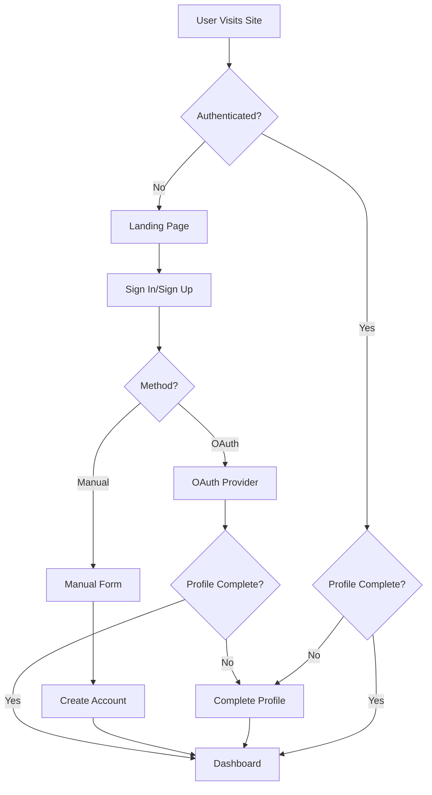

# Voiceflow Authentication System

A comprehensive authentication system built with Next.js 14, NextAuth.js, and MongoDB, featuring multiple authentication methods and profile completion flows.

## 🌟 Features

### Authentication Methods
- **OAuth Providers**: Google and GitHub sign-in
- **Credentials**: Manual sign-up with email/password
- **Profile Completion**: Automatic flow for OAuth users missing required information
- **Session Management**: Secure JWT-based sessions with NextAuth.js

### Database Architecture
- **Multiple MongoDB Databases**: 
  - `voiceflow_auth` - User credentials and authentication data
  - `voiceflow_profiles` - User profiles and personal information  
  - `voiceflow_activities` - User activities, posts, and interactions
- **Type-Safe Operations**: Full TypeScript integration with Mongoose ODM
- **Data Validation**: Comprehensive validation rules and schemas

### User Experience
- **Seamless Sign-Up/Sign-In**: Clean, responsive UI with error handling
- **Profile Completion**: Smart flow to collect missing OAuth user data
- **Dashboard**: Personalized user dashboard showing profile information
- **Route Protection**: Middleware-based protection for authenticated routes

## 📋 Required User Information

The system collects the following information:

### Required Fields (Manual Sign-up)
- Full Name
- Username (unique, 3+ characters)
- Email Address
- Password (8+ characters)
- Date of Birth (13+ years old)
- Gender
- Phone Number

### OAuth Completion Flow
For Google/GitHub users missing required fields:
- Username (if not available from provider)
- Date of Birth
- Gender  
- Phone Number

## 🚀 Getting Started

### Prerequisites
- Node.js 18+ 
- MongoDB instance (local or cloud)
- Google OAuth credentials (optional)
- GitHub OAuth app credentials (optional)

### Installation

1. **Clone and Install**
   ```bash
   git clone <your-repo>
   cd voiceflow
   npm install
   ```

2. **Environment Setup**
   Create `.env.local` based on `.env.example`:
   ```env
   # Database
   MONGODB_URI=mongodb://localhost:27017/voiceflow_auth

   # NextAuth
   NEXTAUTH_URL=http://localhost:3000
   NEXTAUTH_SECRET=your-secret-here

   # Google OAuth (optional)
   GOOGLE_CLIENT_ID=your-google-client-id
   GOOGLE_CLIENT_SECRET=your-google-client-secret

   # GitHub OAuth (optional)
   GITHUB_CLIENT_ID=your-github-client-id
   GITHUB_CLIENT_SECRET=your-github-client-secret
   ```

3. **Database Setup**
   The system automatically creates the required databases and collections:
   - `voiceflow_auth.users` - Authentication data
   - `voiceflow_profiles.profiles` - User profiles
   - `voiceflow_activities.activities` - User activities

4. **Start Development Server**
   ```bash
   npm run dev
   ```

   Navigate to `http://localhost:3000`

## 🏗️ System Architecture

### Authentication Flow



### Database Schema

#### Auth Database (`voiceflow_auth`)
```typescript
interface UserAuth {
  _id: ObjectId
  email: string
  username: string
  password?: string // Only for manual signup
  provider: 'credentials' | 'google' | 'github'
  providerId?: string
  dateOfBirth?: Date
  gender?: string
  phoneNumber?: string
  emailVerified: boolean
  profileComplete: boolean
  isActive: boolean
  lastLogin?: Date
  createdAt: Date
  updatedAt: Date
}
```

### API Routes

- `GET/POST /api/auth/[...nextauth]` - NextAuth.js authentication
- `POST /api/auth/signup` - Manual user registration
- `POST /api/auth/complete-profile` - OAuth profile completion

### Pages

- `/` - Landing page with authentication options
- `/auth/signin` - Sign-in page (OAuth + credentials)
- `/auth/signup` - Manual registration page
- `/auth/complete-profile` - Profile completion for OAuth users
- `/dashboard` - Protected dashboard for authenticated users

## 🔒 Security Features

- **Password Hashing**: bcryptjs with salt rounds of 12
- **JWT Security**: Secure token-based session management
- **Age Validation**: Minimum age requirement of 13 years
- **Input Sanitization**: Comprehensive validation and sanitization
- **Route Protection**: Middleware-based authentication checks
- **CSRF Protection**: Built-in NextAuth.js CSRF protection

## 🎨 UI Components

Built with **shadcn/ui** and **Tailwind CSS**:
- Responsive authentication forms
- Loading states and error handling
- Accessible form components
- Dark/light theme support
- Professional styling and animations

## 🧪 Development & Testing

### Manual Testing Flow

1. **Manual Sign-up**:
   - Visit `/auth/signup`
   - Fill all required fields
   - Verify account creation
   - Test sign-in

2. **OAuth Flow**:
   - Visit `/auth/signin`
   - Click Google/GitHub
   - Complete profile if needed
   - Verify dashboard access

3. **Profile Completion**:
   - Sign in with OAuth (new account)
   - Verify redirect to complete-profile
   - Fill missing information
   - Verify dashboard access

### Database Verification

Check MongoDB collections after testing:
```javascript
// In MongoDB shell
use voiceflow_auth
db.users.find().pretty()
```

## 📝 Customization

### Adding New OAuth Providers

1. Install provider package:
   ```bash
   npm install next-auth/providers/[provider]
   ```

2. Add to NextAuth configuration:
   ```typescript
   providers: [
     // Existing providers...
     NewProvider({
       clientId: process.env.NEW_PROVIDER_CLIENT_ID!,
       clientSecret: process.env.NEW_PROVIDER_CLIENT_SECRET!,
     })
   ]
   ```

3. Update environment variables
4. Update UI components

### Modifying Required Fields

1. Update `REQUIRED_FIELDS` in `/lib/database/schemas.ts`
2. Update validation in API routes
3. Update UI forms
4. Update TypeScript interfaces

## 🤝 Contributing

1. Fork the repository
2. Create a feature branch: `git checkout -b feature-name`
3. Make changes and test thoroughly
4. Submit a pull request

## 📄 License

This project is licensed under the MIT License.

---

## 🔧 Troubleshooting

### Common Issues

**MongoDB Connection Issues**:
- Verify `MONGODB_URI` is correct
- Ensure MongoDB is running
- Check network connectivity

**OAuth Provider Issues**:
- Verify client ID/secret configuration
- Check redirect URI in provider console
- Ensure `NEXTAUTH_URL` matches your domain

**TypeScript Errors**:
- Run `npm run type-check`
- Verify NextAuth type extensions
- Check import statements

**Session Issues**:
- Verify `NEXTAUTH_SECRET` is set
- Clear browser cookies/storage
- Check JWT token validity

### Debug Mode

Enable NextAuth.js debug mode:
```env
NEXTAUTH_DEBUG=true
```

Check browser console and server logs for detailed information.

---

**Built with ❤️ for the Voiceflow community**